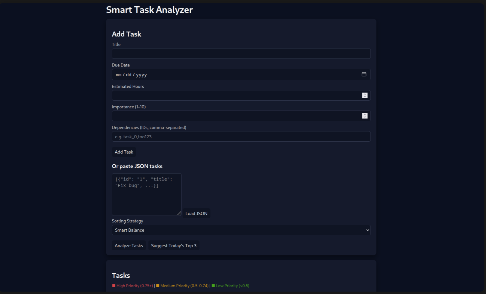

# Smart Task Analyzer

This mini-application is a technical assessment for a Software Development Intern role. It implements a Smart Task Analyzer that scores and prioritizes tasks based on urgency, importance, effort, and dependencies. The stack is Python, Django, JavaScript, HTML, and CSS.

## Setup Instructions

1. Create and activate a virtual environment.
2. Install dependencies:

```bash
pip install django
```

3. Run migrations and start the server:

```bash
cd SmartTaskAnalyzer
python manage.py migrate
python manage.py runserver
```

4. Open `http://localhost:8000/` in your browser to use the UI (NOT the file directly).

## Screenshots

### Main Interface

- Clean dark-themed UI with input form
- Strategy selector (Smart Balance, Fastest Wins, High Impact, Deadline Driven)
- JSON bulk import option
- Analyze and Suggest buttons

### Task Results with Color Coding

- 🔴 **Red (High Priority)**: Score ≥ 0.75 - Do this NOW
- 🟡 **Yellow (Medium Priority)**: Score 0.5-0.74 - Do this soon
- 🟢 **Green (Low Priority)**: Score < 0.5 - Can wait
- Each task shows score, due date, hours, importance, and explanation

## Algorithm Explanation

Each task has: `title`, `due_date`, `estimated_hours`, `importance (1–10)`, and `dependencies` (list of task IDs). The core logic lives in `tasks/scoring.py` and is exposed through the endpoints:

* `POST /api/tasks/analyze/`
* `GET /api/tasks/suggest/`

The algorithm first normalizes the main factors:

* **Urgency**: Based on how close or overdue the `due_date` is. Overdue tasks get the highest urgency; tasks far in the future get lower urgency. Dates are normalized into a 0–1 range.
* **Importance**: The 1–10 scale is converted to 0–1 by dividing by 10.
* **Effort**: `estimated_hours` is normalized relative to the largest effort in the list. A "quick win" value is computed as `1 - effort_norm`, so smaller tasks are favored when required.
* **Dependencies**: The algorithm counts how many other tasks depend on a given task. Tasks that unblock many other tasks get a higher dependency weight.

Multiple strategies are supported:

* **Fastest Wins**: Prioritizes the quick-win score so that very small tasks bubble up.
* **High Impact**: Heavily weights importance, with some urgency.
* **Deadline Driven**: Uses only urgency.
* **Smart Balance**: Combines importance (40%), urgency (30%), quick wins (15%), and dependency weight (15%).

Circular dependencies are detected via a depth-first search graph traversal. Tasks participating in a cycle are slightly penalized and receive an explanation note.

## Design Decisions

I chose a stateless API design. `POST /api/tasks/analyze/` accepts a list of tasks in the request body. `GET /api/tasks/suggest/` accepts tasks as a URL-encoded JSON array in a query parameter for simplicity (no authentication or database persistence required). This keeps the focus on the scoring logic instead of CRUD.

The implementation uses pure Django with JsonResponse for JSON handling. The model file exists for future persistence, but the current scoring implementation operates on in-memory dictionaries.

## Running Tests

```bash
cd SmartTaskAnalyzer
python manage.py test tasks
```

## API Endpoints

### POST /api/tasks/analyze/
Analyze and score a list of tasks.

**Request:**
```json
{
  "tasks": [
    {
      "id": "task_1",
      "title": "Fix login bug",
      "due_date": "2025-11-30",
      "estimated_hours": 3,
      "importance": 8,
      "dependencies": []
    }
  ],
  "strategy": "smart_balance"
}
```

**Response:** Sorted list of tasks with scores and explanations.

### GET /api/tasks/suggest/
Get top 3 suggested tasks for today.

**Query Parameters:**
- `strategy`: Sorting strategy (default: smart_balance)
- `tasks`: URL-encoded JSON array of tasks

## Time Breakdown

- Algorithm design: 45 min
- Backend implementation: 45 min
- API endpoints: 30 min
- Frontend UI: 30 min
- Testing: 20 min
- Documentation: 15 min

**Total: ~3 hours**

## Future Improvements

With more time, I would:
- Add real database persistence for task history
- Visualize dependency graphs
- Incorporate weekends/holidays in urgency calculation
- Add Eisenhower Matrix view (Urgent vs Important)
- Implement user feedback loop for algorithm learning
- Add task completion tracking and analytics
